# Basics
In this chapter you will learn the basics of MORYX and how it helps you to set up a production.

## Use Case

Your customer *Pencilla Inc.* produces pencils. The production needs prepared 
material - wooden slats and graphite - and consists of the following four steps:​

* Assembling: Glue slats and graphite together​ and shape it.
* Colorizing: Add paint and imprint text
* Testing: Test if the pencil writes and if the colors are visible on paper.
* Packing: Pack each article in a box​

Each step is executed on a separate workstation, where a worker has to follow
instructions and may operate a machine.

For more information about pencil production, look [here](https://musgravepencil.com/blogs/news/howapencilismade).

## Setup
  
To setup a new project, you need the *MORYX CLI* installed. If you have installed
VisualStudio already, you would use `dotnet` tools:

```
$ dotnet tool install -g moryx.cli
```

Use `moryx new` to create a new MORYX application. It bootstraps a new C# solution
using the provided name and optionally takes additional parameters like `--steps`, 
`--products`. Thus, it enables you to initialize everything you need in a single
command:

```
$ moryx new <NAME> --steps <LIST-OF-STEPS> --products <LIST-OF-PRODUCTS>
```

Considering *Pencilla Inc.* to apply MORYX to the whole factory, you decide to
use `PencilFactory` as the project name but it could also be a machine name, for
example. Optionally you can provide the steps and products already to the `new`
command. The products (`GraphitePencil`, made from `Slat` and `Graphite`) have already been 
identified, but only `GraphitePencil` is needed so far.
Even though, there are four production steps, in the first iteration,
only the `Assembling` step should be covered by MORYX. These information result
in the following command:

```
$ moryx new PencilFactory --steps Assembling --products GraphitePencil
```

This should not only leave you with a solution `PencilFactory.sln` inside
the new folder `PencilFactory`. It also does some initial configuration
and ships empty databases. 
 
That means, you can directly open it in Visual Studio and dig into it. Before
you run the app, you might need to [install licenses](#encountering-wupiexceptions).

Run the application (press `F5`).

> *Note* Starting it for the first time will restore NuGet packages.That can 
> take a few minutes.

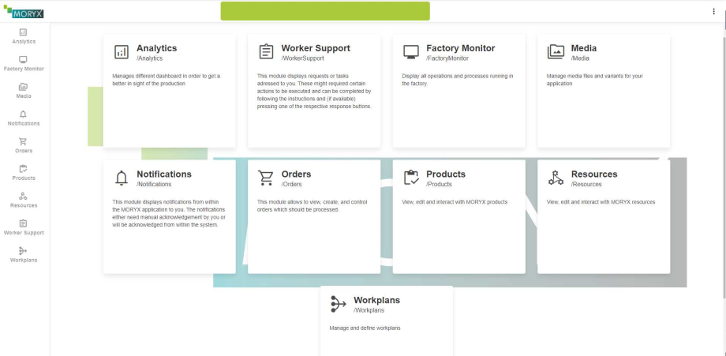


Now that you have a running MORYX instance, you need to create some databases. 
To skip the UI here and speed things up, you'll use the MORYX CLI again.

While the application is still running, `moryx exec post-setup` will create empty 
databases and restart dependent modules. If your application runs on a different
host than `https://localhost:5000`, you can specify that by the `--endpoint <URL>`
option.

```
$ moryx exec post-setup
```

## Products

At first, you will model [products](https://github.com/PHOENIXCONTACT/MORYX-Framework/blob/main/docs/articles/Products/Concept.md).
Products represent the articles to be manufactured. MORYX differentiates between 
`ProductType` and `ProductInstance`. The `ProductType` is what you can order 
in a catalog, while the `ProductInstance` is what you would receive after ordering: 
an instance of the product with its unique serial number. In order for a `ProductType` 
to be produced, it needs a corresponding `ProductInstance`. For further 
information on how to create a product, see [this](https://github.com/PHOENIXCONTACT/MORYX-Framework/blob/main/docs/tutorials/HowToCreateAProduct.md).

Let's take a look at the composition of the pencil *Pencilla Inc.* produces.

* A pencil consists of 2 wooden slats and 1 graphite in the middle.
* The pencil has a color (green or brown).
* Graphite can be in different degrees of hardness, in this scenario *2B*, *B* and *HB*.

> **Note** that, when defining the hardness of pencils, the number (degree) is
> put first (2B, 2H, etc.). Since this can't be represented in code, it is
> switched for names, while for everything else the official format is used. If
> you are interested, you will find more about [grading and classification here](https://en.wikipedia.org/wiki/Pencil#Grading_and_classification).

From the details above, the `GraphitePencilType` needs 

* a color property
* a hardness property
  
You will find the `GraphitePencilType` among all other `<Product>Types` in the
`PencilFactory` package within the `Products` folder.

For properties to be shown in the UI, add the [EntrySerialize](https://github.com/PHOENIXCONTACT/MORYX-Framework/blob/dev/docs/articles/Core/Serialization/EntryConvert.md#entryserialize-attribute)
attribute. For properties to be saved in the database, use the [DataMember](https://learn.microsoft.com/en-us/dotnet/api/system.runtime.serialization.datamemberattribute?view=net-7.0) attribute.

``` cs
public PencilColor Color { get; set; }

public GraphiteHardness Hardness { get; set; }
```

To make the code compile so far, you still need to implement the enums `PencilColor` and `GraphiteHardness`.
You can do that easily by moving the cursor to the red underlined name, press
`Ctrl + .` and select `Generate class 'PencilColor' in new file`. Then, go to 
that file, change `class` to `enum` and add the required attributes:

```cs
public enum PencilColor
{
    Green = 1,
    Brown = 2,
}
```

Do the same for `GraphiteHardness`.

```cs
public enum GraphiteHardness
{
    [Display(Name = "B")]
    B = 1,
    [Display(Name = "HB")]
    HB = 2
}
```


### Create Products

To create a product, you need to run the application now and head to the 
**Products UI**. 

Click on the plus button to open the 'Product Importer' menu. This title may 
sound a bit confusing, but it lets you add new products. 

> *Note* The naming here comes from the fact, that you wouldn't necessarily add
> products here, but 'import' them from other systems.

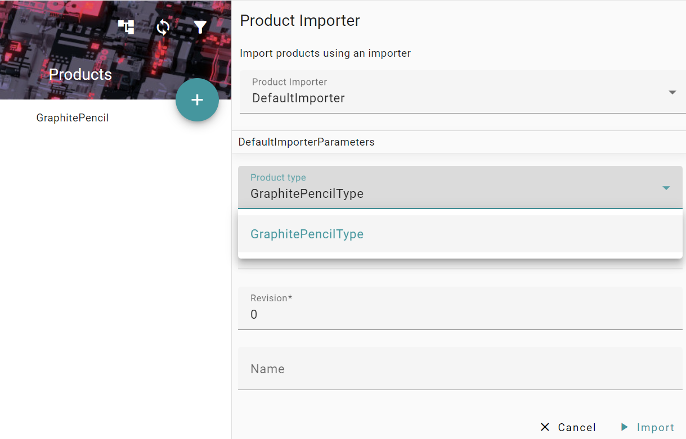

* Click on the ProductType dropdown and select **GraphitePencilType**
* Fill in the fields 
  * *Identifier*: `100001` 
  * *Revision*:  `0`
  * *Name*: `GP-1B`
* Click on **Import**. 
* Click on the product you just added: `100001-00 GP-1B`
* Click on the edit icon at the top right to edit.
* In the `Color` dropdown choose `Green`
* In the `Hardness` dropdown choose `B` as the hardness, which represents `1B`
  in this case.
* Save your changes by clicking on the save icon at the top right corner.

 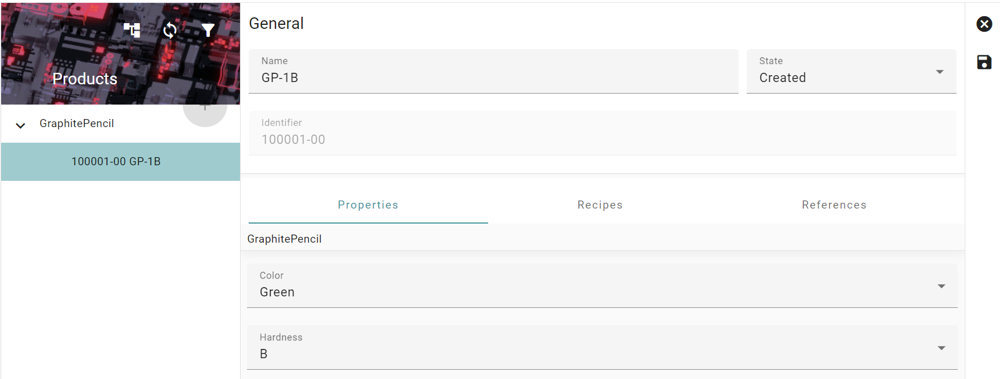

Repeat the same steps for a second product:


* `GraphitePencilType`
  * *Identifier*: `100002`
  * *Revision*: `0`
  * *Name*: `BP-HB`
  * *Hardness*: `HB`
  * *Color*: `Brown`

If you did everything correctly, you should end up with something more or less 
similar to the image below.

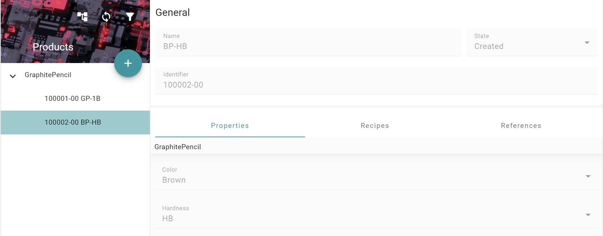

Now you should have your products `100001-00 Brown Pencil GP-1B` and 
`100002-00 Green Pencil GP-HB`. 
The next challenge is to actually let a resource produce the pencils. So far there is 
no script that describes how the pencils are produced. 
Therefore, the next step is to model a resource after which we can create a **Recipe** and a 
[Workplan](https://github.com/PHOENIXCONTACT/MORYX-Framework/blob/dev/docs/articles/Processing/Workplans.md). 


## Resources

We begin with modeling the assembling station, used to assemble the pencils. This
is where resources come into play.

Resources represent physical assets and logical objects like robots or drivers 
within a cyber physical system. They can be coupled with active devices or represent 
passive objects like a table. The main advantage of this concept is that the 
resource interface and implementation structure is the same for all resources.
So accessing a resource is done in an abstract and general way. Processing, 
configuring and visualization of a resource is done in the same way with the    
same classes. Extending a default resource can be done in a standard way and 
includes expansion of the default UI as well.

Together with the customer you have figured out the following requirements as 
the first steps to digitalize their factory:

* They want to equip their assembling station with a screen
* The screen should display the instructions, a worker should follow
* When workers have finished a task, they click on the screen to confirm it

Based on these requirements

* The cell should display a workersupport screen to the worker
* Depending on the workers input (*success*, *failure*) the product either moves
  to the next station or goes into a scrap container


### Add worker support

The `AssemblingCell`, which you will find in `PencilFactory.Resources`, 
already has an instructor.

``` cs
[ResourceReference(ResourceRelationType.Extension)]
public IVisualInstructor Instructor { get; set; }
```

`IVisualInstructor`
is the interface for a digital resource displaying the visual instructions on a 
screen and requires workers to interact by pressing buttons.

`ResourceReference`
is an attribute that links two or more resources together. It's a mechanism that
is used to save and load the source and the target relationship in the database.

You can start now to map the real world into digital twins using MORYX. As a 
recap, the following is planned for the pencil factory:

There should be one assembling station (cell), which will have a monitor to show
instructions to a worker. So the following resources are needed:

* 1 `AssemblingCell`
* 1 `VisualInstructor`

You will set up these in MORYX within the *Resources UI* by clicking the "+" 
button and selecting the required cell.


> **Note** Make sure to deselect all cells before adding more, so that they will
> be added to the root level and not as children of other resources. Even though,
> that wouldn't do any harm.

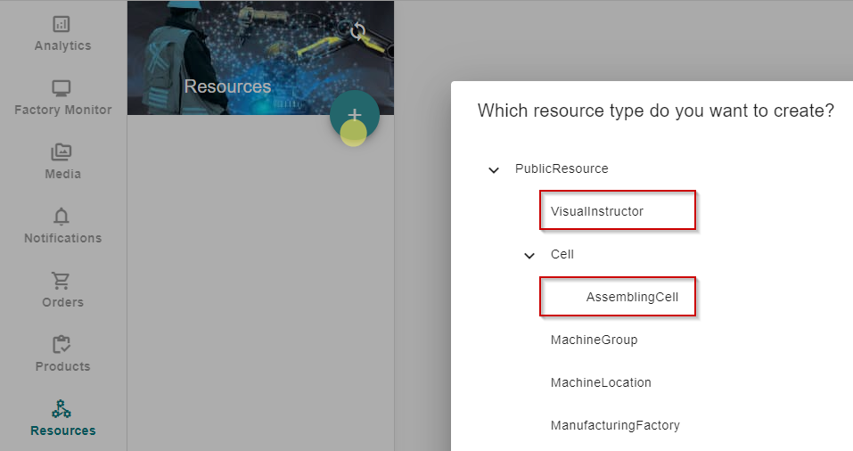

In the following dialog it is ok to go with just the typename as the cell 
identifier. 

If you then select the *AssemblingCell* and click the edit button, you can assign 
the previously created *VisualInstructor* to its *Instructor* property.

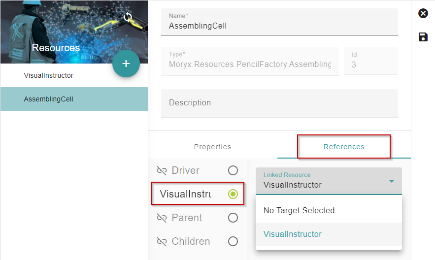


### Sessions

Cell and Instructor are now connected, but they do not interact with each other.
Therefor, you need to implement the cells session handling. But before you do, 
you will get a short introduction about how this works in theory and the 
vocabulary that is used within MORYX.

*Sessions* are considered the sum of all tasks a resource (in this case a cell) 
has to perform on a single product instance. A session may consist of multiple 
*sequences*, which contain a single *activity*. 

While *sessions* and *activities* are represented by types, *sequences* are more
of a concept.

Usually a *session* (and with it a *sequence*) is started by a resource, telling
the process engine, that it is *ReadyToWork*. 

Then with `ActivityStart()` the process engine can tell a resource, that it 
should start working on a product. After the resource has finished its job, it 
will signal this with `ActivityCompleted()`.

When the process engine has processed the *ActivityResult* (submitted by `ActivityCompleted`),
it will "close" the sequence with `SequenceCompleted()`.

Then, the resource could continue the current *session* (`ContinueSession`) with
another *sequence* or start a whole new *session* by signaling `ReadyToWork`. 

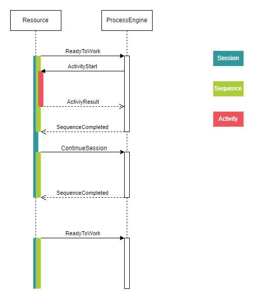

Now, you will convert theory into practice and begin with starting a *session*.
To do so, update the `ControlSystemAttached()` method to the following: 

```cs
public override IEnumerable<Session> ControlSystemAttached()
{
    yield return Session.StartSession(ActivityClassification.Production, ReadyToWorkType.Push);
}
```

`ControlSystemAttached()` gets called in the event of the ControlSystem being 
attached to the resource, which is, when the application gets started.
 
In here you will yield return a new session using `Session.StartSession()` and 
thus signal `ReadyToWork` to the ProcessEngine.

* `ReadyToWorkType.Pull` is used to retrieve an activity, that is assigned to 
  the cell. If there is no activity, it would result in a `SequenceCompleted()`.
  This is typically used to start activities if a product is already 'in' a 
  cell.
* `ReadyToWorkType.Push` *won't* result in a `SequenceCompleted()`, but would
  'wait' for an acitvity, like subscribing for push notifications.
* `ActivityClassification.Production` is used to notify that the cell is ready to
 work on an `Activity` of type `production`.

Since that should result in an `ActivityStarted` event, the next thing to
 implement will be the `ActivityStarted()` function. Find the comment
`/* Start execution here */` and replace it so that the whole function looks 
like this:

```cs
public override void StartActivity(ActivityStart activityStart)
{
    _currentSession = activityStart;
    switch (activityStart.Activity)
    {
        case  AssemblingActivity activity:
            VisualInstructor.Execute(Name, activityStart, CompleteInstruction);
            break;
    }
}
```

That wouldn't compile so far, because there is no `CompleteInstruction` right 
now, which is provided as a delegate to `Instructor.Execute`. That means, you 
have to implement `CompleteInstruction()`, that gets called, when an instruction
has finished, i.e.: When a worker has finished their task.

```cs
private void CompleteInstruction(int instructionResult, ActivityStart activity)
{
    var result = activity.CreateResult(instructionResult);
    _currentSession = result;
    PublishActivityCompleted(result);
}
```

These previous lines will complete the activity by publishing an `ActivityResult` 
to the ControlSystem. 

And finally, the method that gets called on a cell after completing work is 
`SequenceCompleted()`. In here you start a *ReadyToWork* session again, using 
`PublishReadyToWork()` and update `_currentSession`.

```cs
public override void SequenceCompleted(SequenceCompleted completed)
{
    _currentSession = completed;

    var rtw = Session.StartSession(ActivityClassification.Production, ReadyToWorkType.Push);
    PublishReadyToWork(rtw);
    _currentSession = rtw;
}
```

## Start production

### Create a *Workplan*

In order to produce pencils, you have to establish the connection between cells
and products: MORYX needs to know, how a product flows through the production 
line. This is not done in the code, but modelled within [Workplans](https://github.com/PHOENIXCONTACT/MORYX-Framework/blob/main/docs/articles/Processing/Workplans.md).

This allows you to define in a rather abstract way, *what* needs to be done without
going much more into details. MORYX will find the way later, *how* this is done
for a running order. 

Start the application, go to *Workplans* and click on the plus button.

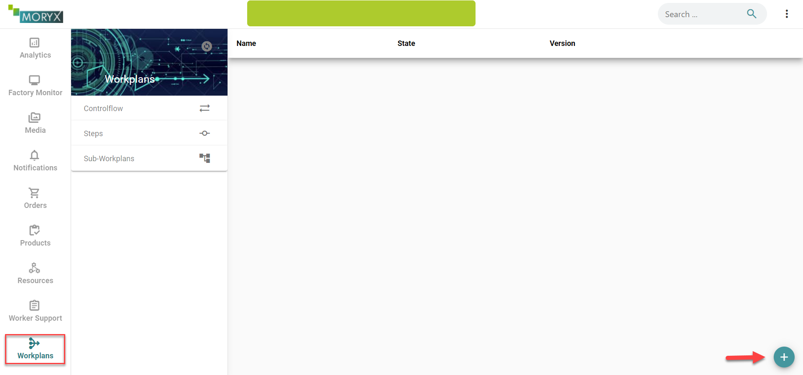

Drag an *Assembling Task* step to the workplan and connect the inputs and outputs.

The available *Steps* correlate to the code, that has been generated and was 
shipped together with the *assembling* resources.
 
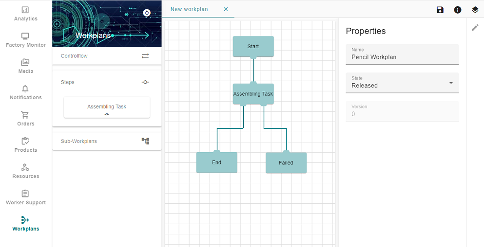

You want to configure the text that is displayed on the worker instruction. 
Click on the *Assembling Task* step to edit it and configure it as shown in 
the screenshot below. The text to put in could be `Put the graphite into the slats and glue them together. Then cut the result into pieces and shape each of them`. But could be
anything you want.

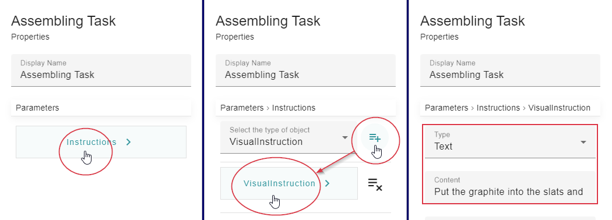

When you are done, modeling your workflow, you have to save the workplan. 


### Add a *Recipe*

In order to make the connection between a `Product` and the `Workplan` you just 
created, you need a *Recipe*.

Go to *Products* and select the *Product* you want to produce, that is the 
*GraphitePencil*. Click on the *Recipes* tab and the edit button located on the
top right corner. Click the *Add Recipe* button, located on the bottom left 
corner to add a new recipe. 

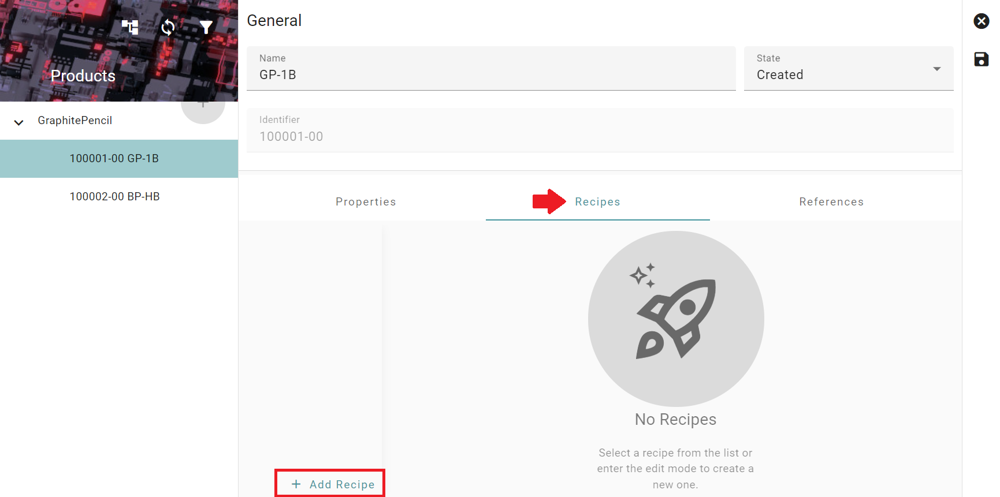

* Select the **ProductionRecipe**, give the recipe a name `PencilRecipe` and select 
your created workplan `Workplan`. 


* Click on **Create** for the recipe to show up in the products UI. 
* For the recipe to be automatically selected when the product is produced, select 
`Default` Classification.
* Save your changes by clicking on the save icon located at the top right corner.


* Repeat the same steps for the second product `100002-00 Green Pencil GP-HB`.

### Start production

To create a new `Order`. Navigate to the *Orders* UI.

* Click on the add button at the bottom right.

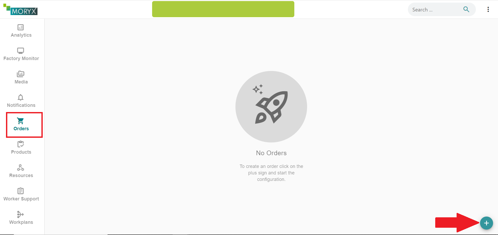


Fill in the details of the `Order`: 

* *Order Number*: ` 000001` . 
* *Operation Number*: ` 0001`.
* *Product*: ` 100001-00 GP-1B`
* *Recipe*: ` Pencil Recipe`
* *Amount*: ` 5`

Click on the plus button to add this as an operation to the order. One order
can have multiple operations, but this is not needed here. Click *CREATE* to 
create the order.

* Click on *BEGIN* to start the production of the order.

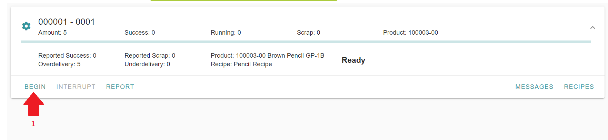

* Enter `1` as the `Partial Amount`.
* Then click on  *BEGIN* to start the production.

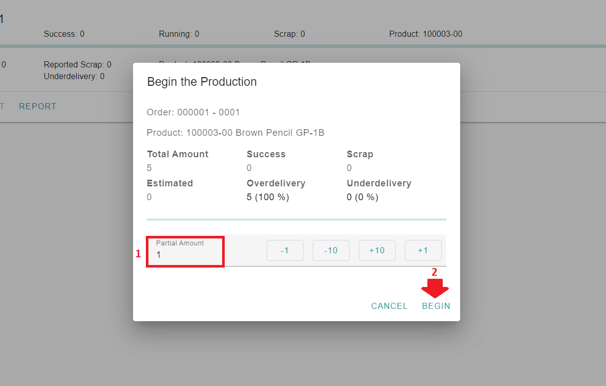

Now the production is running!

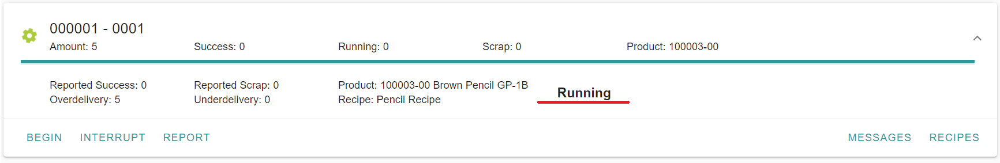

That's it, you should now be able to let the pencils flow through the assembling
cell.

In order to see the visual instructions, go to the module `Worker Support` and select for VisualInstructor as Display

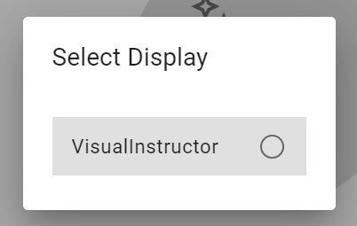

Use the `SUCCESS` and `FAILED` action to make the products flow through the production line


## Troubleshooting

Here you will find a list of common problems, that might occur, and how to fix
them. 

### Encountering `WupiException`s

>  `WupiException: Der CmContainer-Eintrag wurde nicht gefunden, Fehler 200.`

The application depends on MORYX modules, that are licensed. But no worries:
They ship with developer licenses, that need to be activated:

* Open *CodeMeter Control Center*, 
  which you should have installed beforehand through the [CodeMeter User Runtime (Version 8.x)](https://www.wibu.com/de/support/anwendersoftware/anwendersoftware.html)
* Drag & Drop the `.WibuCmRau` files onto it
  

