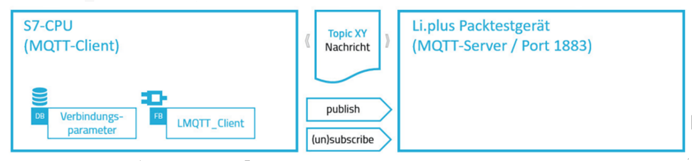

# Basics

## Use Case

Your costumer produces ElectronicDevices. The production consists of the following four steps:​

* Assembly: Put everything together​
* Soldering: Solder​
* Testing: Test if it works​
* Packing: Pack each article in a box​

Each step will be done by a full automatic cell, which can only do this specific step​



The driver of the TestingCell uses **MQTT** for communication


### Message structure

```json
{ ​
  "parameter1": "Value1",​
  "parameter2": "Value2",​
  …​
} ​
```

### Commands 

#### `cpp/command/start` - Start measuring​

* `measurementplanId`: Id of the measuring workflow​
* `Name`: Name of the measuring workplan​
* `Serialno`: Serialnumber​


#### `cpp/command/abort` – Abort the running measurement​

### Subscriptions​

#### `api/measurements/updates` – Result of a single measurement​


## Task 

Create a basic application using the script and add SimulationNotification. ​
Add the `ProductType` `ElectronicDeviceType` and its corresponding instance `ElectronicDeviceInstance​`

​Create the following cells without any extra properties. Each cell has a driver.​

* AssemblyCell​
* SolderingCell​
* TestCell​
* PackagingCell​

The drivers for the `AssemblyCell`, `SolderingCell` and `PackagingCell` just implement `ISimulationDriver` and use no specific messaging protocol.​

### Related doumentation

* [Resources](https://github.com/PHOENIXCONTACT/MORYX-Framework/tree/dev/docs/articles/Resources)  
* [Products]((https://github.com/PHOENIXCONTACT/MORYX-Framework/tree/dev/docs/articles/Products))  
* [How to create a resource](https://github.com/PHOENIXCONTACT/MORYX-Framework/blob/dev/docs/tutorials/HowToCreateResource.md)  
* [How to create a product](https://github.com/PHOENIXCONTACT/MORYX-Framework/blob/dev/docs/tutorials/HowToCreateAProduct.md)

## Hands on

The driver of the TestCell uses MQTT to communicate with the Testing system. Because of that, it has to implement the IMessageDriver.​

We have three MQTT topics. The payloads themselves are json object, so the JsonTopic can be used. For each message a specific class has to be created.​

The result of the activity depends on the difference from the expected value.​

Create a real driver, which you will test with a mosquitto broker, and a simulated one.


Now we will add everything else needed for the production. Our use case will have the following four steps​

* Assemble​
* Soldering​
* Testing​
* Packing​

For each step we will create an *Activity*, a *Task*, *Parameters* and *Capabilities*. As results we will use the `DefaultActivityResult`.​

TODO: Link to documentation? like [Activitiy](http://where.do-i-find.this)

The first activity of the process (in our case the `AssemblyActivity`) is special, since it has to create the `ProductInstance`. For that to happen automatically, the activity has to implement `IInstanceModificationActivity`.​

Since we are simulating the production, the Parameters have to implement `ISimulationParameters`.​

Don't forget `parameters.ExecutionTimeSec = ExecutionTimeSec;` in the `Populate()` method.
TODO: Why?

### Capabilities

For the capabilities a check for the type is enough in the first step. Add the capabilities to the corresponding resources.​

Now you should have everything and can start your project. Configure the whole application manually and try the production.​

#### Related doumentation

[How to create a process including parameters, capabilities, activities and tasks?](https://github.com/PHOENIXCONTACT/MORYX-Framework/blob/dev/docs/tutorials/HowToCreateEverythingForProduction.md)

#### How do they work?

TODO: Add image with explanation