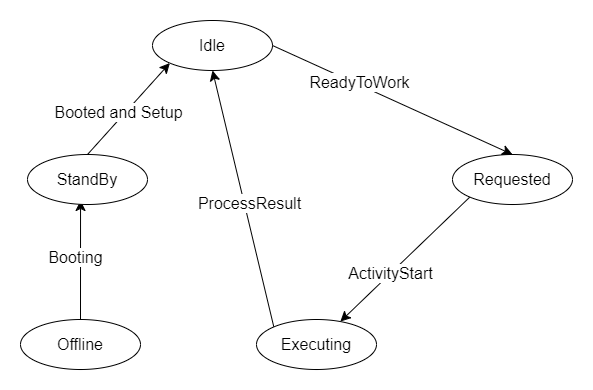
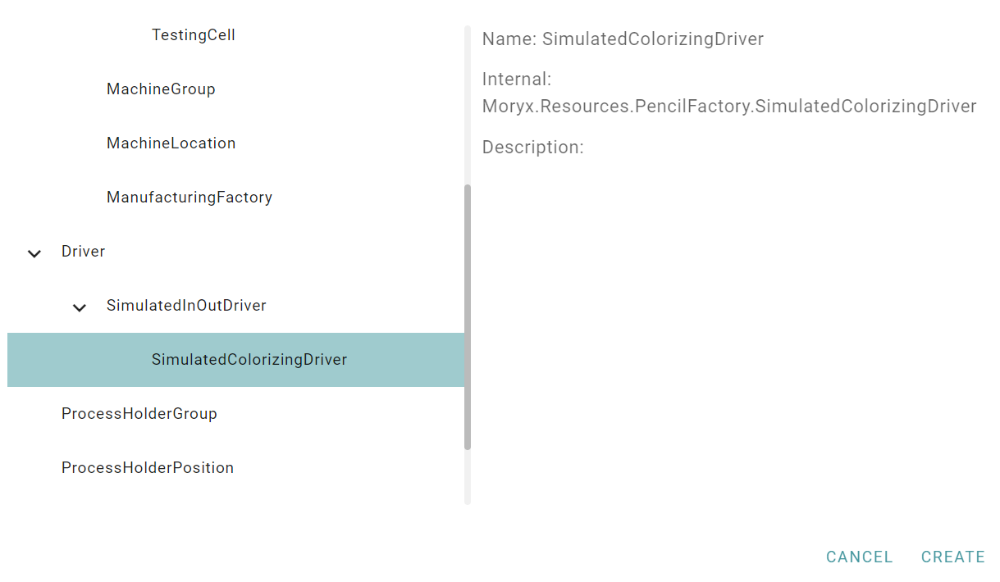
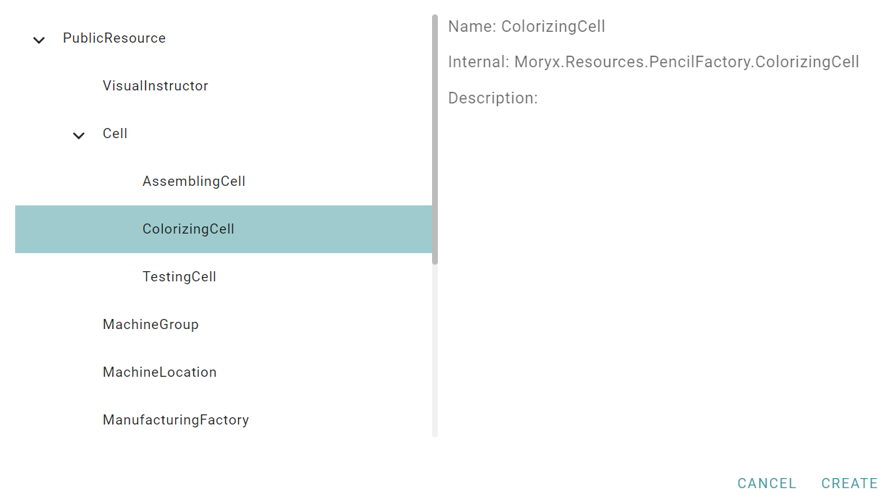
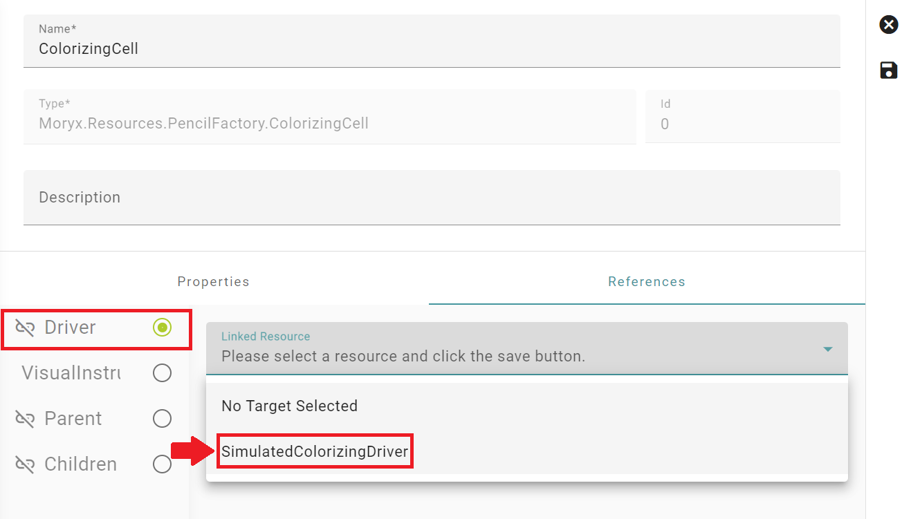
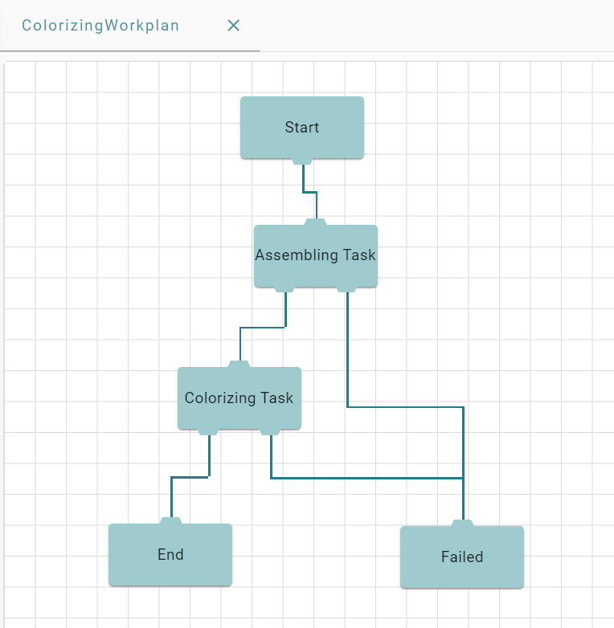

# Driver
In this chapter you will implement the ColorizingCell and the TestingCell. 
Both of them are automatic cells, which don't need any user interaction. 
Correspondingly there are no visual instructions. Instead there is some kind of hardware, which needs to be connected to MORYX.

For the cell to communicate with the hardware a [Driver](https://github.com/PHOENIXCONTACT/MORYX-Framework/blob/dev/docs/tutorials/HowToBuildADriver.md) is needed. 
In here the communication is encapsulated.

As there are many different ways to communicate, there are also many different implementations of drivers. 
Common interfaces for drivers are `IMessageDriver<TMessage>` and `IInOutDriver`.
* The `IMessageDriver<TMessage>` is used for message based protocols. The driver is able to send and receive messages. When a new message is received, an event gets invoked. A typical protocol would be MQTT.
* The `IInOutDriver` can read and write variables on a server. A typical protocol is OPC UA. 

## Simulated InOutDriver
You will start with the ColorizingCell. Since the cell isn't finished yet, the manufacturer wants you to [simulate](https://git-ctvc.europe.phoenixcontact.com/moryx/moryx-simulation/-/blob/dev/docs/tutorials/how_to_simulate_my_production.md) the communication first. 

Use the CLI to add the Colorizing step to the project.
```
moryx add step Colorizing
```
Now, in order to use simulation, add the package `Moryx.Drivers.Simulation` to the project `PencilFactory.Resources`.

The ColorizingCell is using a protocol, where it can read and write variables on the physical cell.

1. When the physical cell is ready to work, it will set the input `Ready` to `true`.
2. The digital twin will send a `ReadyToWork`. 
3. When the cell receives an activity, set the output `ProcessStart` to `true`. 
4. Read the result from the input `ProcessResult`. 

For a protocol like that the `IInOutDriver` makes the most sense. Open the ColorizingCell and replace the already generated `IMessageDriver` by an `IInOutDriver`. Also add constants for the names of the variables to read and write.

```cs
[ResourceRegistration]
public class Colorizing : Cell
{
    private const string ProcessStart = "ProcessStart";
    private const string ProcessResult = "ProcessResult";
    private const string ReadyToWork = "Ready";

    [ResourceReference(ResourceRelationType.Driver)]
    public IInOutDriver<bool,bool> Driver { get; set; }
    
    ...
}
```

In order to recognize, when an input changes, subscribe to that in  `OnInitialize` and when the driver is set. If you don't also subscribe to the event in the setter of the driver, you will always have to restart the system after changing the driver of a cell.

```cs
private IInOutDriver<bool,bool> _driver;

[ResourceReference(ResourceRelationType.Driver)]
public IInOutDriver<bool, bool> Driver
{
    get { return _driver; }
    set
    {
        _driver = value;
        if (_driver != null)
            _driver.Input.InputChanged += OnInputChanged;
    }
}
```

```cs
protected override void OnInitialize()
{
    ...

    if (_driver != null)
        _driver.Input.InputChanged += OnInputChanged;
}
```


In the method `OnInputChanged` you will check, if the value of `Ready` has changed. If it is true, send a `ReadyToWork` to the ProcessEngine.

```cs
private void OnInputChanged(object sender, InputChangedEventArgs e)
{
    if (e.Key.Equals(ReadyToWork) && _driver.Input[ReadyToWork] && !(_currentSession is ActivityStart))
    {
        var rtw = Session.StartSession(ActivityClassification.Production, ReadyToWorkType.Pull);
        _currentSession = rtw;
        PublishReadyToWork(rtw);
    }

    ...
}
```

If the changed input is `ProcessResult`, read the result from the input and publish it as `ActivityCompleted`. Also set the input `ProcessStart` back to false, so that the physical cell is able to detect when to start the next process. If you don't reset the value of `ProcessStart`, the physical cell is not able to recognize the specific moment an activity should start. Some physical cells also only recognize rising or falling edges. Constant values would trigger nothing.

```cs
private void OnInputChanged(object sender, InputChangedEventArgs e)
{
    ...
    else if (e.Key.Equals(ProcessResult) && _currentSession is ActivityStart activitySession)
    {
        _driver.Output[ProcessStart] = false;
        var processResult = _driver.Input[ProcessResult];

        var result = activitySession.CreateResult(processResult ? (int)ColorizingActivityResults.Success : (int)ColorizingActivityResults.Failed);
        _currentSession = result;
        PublishActivityCompleted(result);
    } 
}
```

In order to start an activity on the physical cell when an activityStart is received, set `ProcessStart` to `true`.
```cs
public override void StartActivity(ActivityStart activityStart)
{
    _currentSession = activityStart;
    switch (activityStart.Activity)
    {
        case Colorizing​Activity activity:
            _driver.Output[ProcessStart] = true;
            break;
    }
}
```

The `SessionCompleted` can be implemented in the same way as in the AssemblingCell.

```cs
public override void SequenceCompleted(SequenceCompleted completed)
{
    _currentSession = completed;

    var rtw = Session.StartSession(ActivityClassification.Production, ReadyToWorkType.Push);
    PublishReadyToWork(rtw);
    _currentSession = rtw;
}
```

The same applies for `ControlSystemAttached`.

```cs
public override IEnumerable<Session> ControlSystemAttached()
{
    yield return Session.StartSession(ActivityClassification.Production, ReadyToWorkType.Push);
}
```

Now you have to implement the driver. Create a new driver `SimulatedColorizingDriver` in the project `PencilFactory.Resources`, which is derived from `SimulatedInOutDriver<bool, bool>` and add the constants for the variable names. 

```cs
[ResourceRegistration]
public class SimulatedColorizingDriver : SimulatedInOutDriver<bool, bool>
{
    private const string ProcessStart = "ProcessStart";
    private const string ProcessResult = "ProcessResult";
    private const string ReadyToWork = "Ready";

    ...
}
```

A `SimulationDriver` has several states, which are needed in order for the SimulationModule to know what happens. After the system has booted, the driver is in the state `Idle`. Is a product arriving, the cell sends a `ReadyToWork` and the driver changes its state to `Requested`. During production the state is `Executing` and afterward it changes back to `Idle`.



The method `Ready` gets called by the simulation module, when there is a new Process for this cell. In a real production this method represents the moment a product arrives at the physical cell. The state changes to `Requested`.

```cs
public override void Ready(IActivity activity)
{
    SimulatedState = SimulationState.Requested;
    SimulatedInput.Values[ReadyToWork] = true;
    SimulatedInput.RaiseInputChanged(ReadyToWork);
}
```

The method `OnOuputSet` gets called when outputs are changed. In this example only the output `ProcessStart` gets set, which would activate the production.

```cs
protected override void OnOutputSet(object sender, string key)
{
    if (key == ProcessStart)
    {
        SimulatedInput.Values[ReadyToWork] = false;
        if (SimulatedOutput.Values[ProcessStart])
            SimulatedState = SimulationState.Executing;
        else
            SimulatedState = SimulationState.Idle;
    } 
}
```

The method `Result` gets called after the (simulated) physical cell has finished its task. It sets the input `ProcessResult` in order to pass on the result to the digital twin.

```cs
public override void Result(SimulationResult result)
{
    SimulatedInput.Values[ProcessResult] = result.Result == (int) ColorizingActivityResults.Success;
    SimulatedInput.RaiseInputChanged(ProcessResult);
}
```

Now you have to configure the driver and the cell in the UI.





Add the driver as a reference to the cell the same way as you did with the VisualInstructor.



Then create a new workplan containing both steps and add it through a recipe to a new product.



Now you should be able to start a new production.


